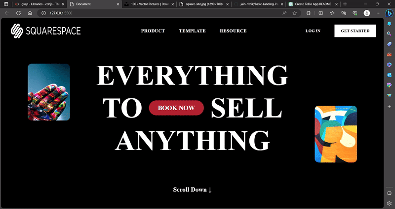

# Landing Page with GSAP Animation

This is a simple landing page project created using HTML, CSS, and GSAP (GreenSock Animation Platform) for smooth animations.

## Demo

You can view a demonstration of the Landing Page below:



## Features

- Modern and responsive design.
- Attractive GSAP animations.
- Easy to customize and integrate into other projects.
- Designed as a starting point for web development projects.

## Installation

1. Clone the repository to your local machine:

   ```bash
   git clone https://github.com/your-username/landing-page.git
2. Open the project folder in your code editor.
3. Open the `index.html` file in your web browser to view the landing page.

## Usage
1. Open the `index.html` file in a web browser to view the landing page.
2. Customize the content and styles in the HTML and CSS files to fit your project's needs.

## Contributing
If you'd like to contribute to this project, follow these steps:

1. Fork the repository on GitHub.
2. Create a new branch with a descriptive name (`git checkout -b feature/your-feature-name`).
3. Make your changes and commit them (`git commit -m 'Add your changes here'`).
4. Push your changes to your forked repository (`git push origin feature/your-feature-name`).
5. Create a Pull Request on the original repository.